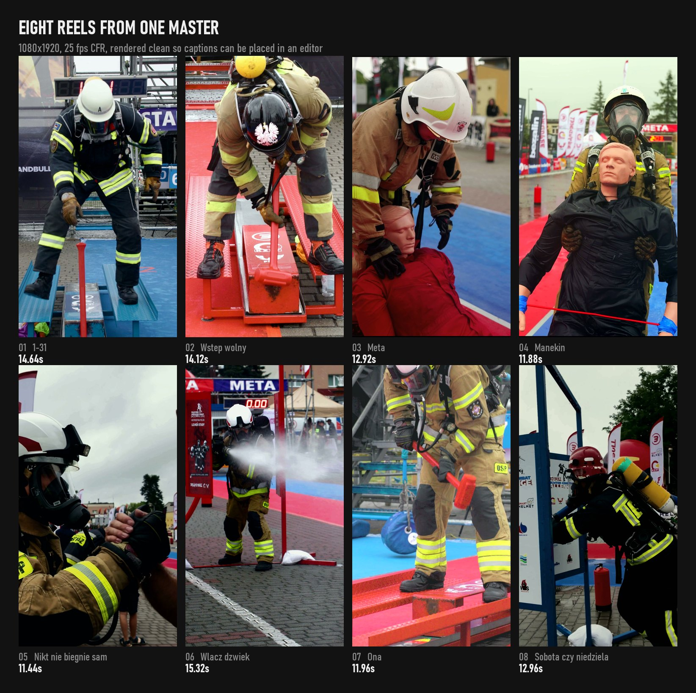
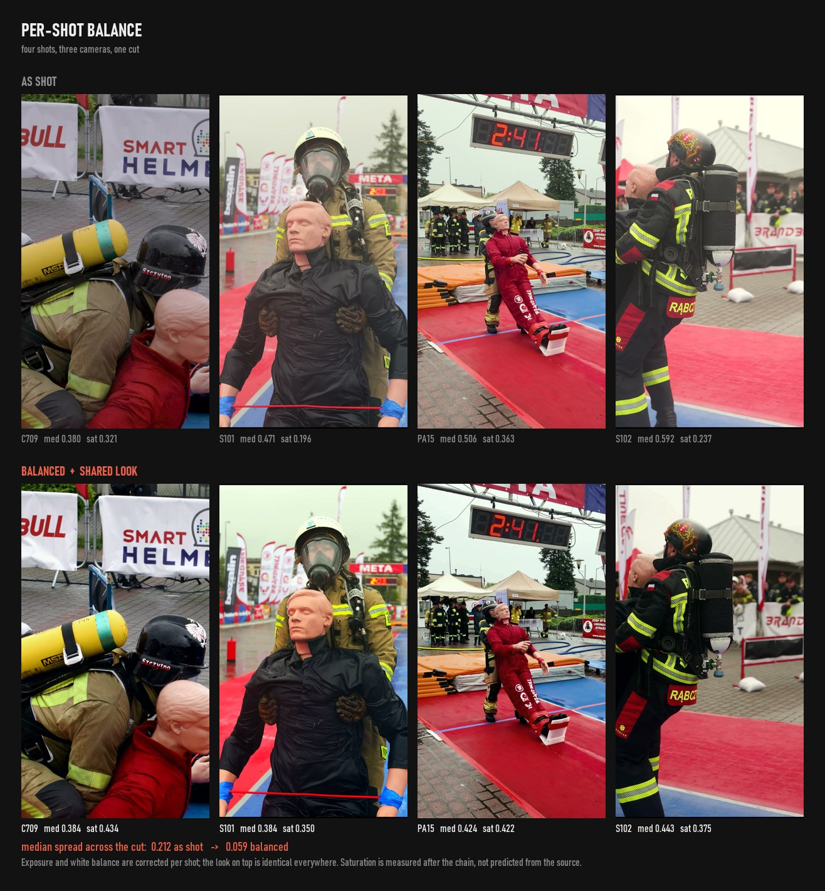

# reelsmith

A step-gated pipeline for turning raw footage into finished short-form vertical
video. Claude Code plugin, three skills, ten scripts.

It is deliberately brand-agnostic. It will extract and use a brand if one exists,
and it will not invent one if there isn't.



*Eight reels cut from a single 9:43 master — shot detection, per-shot grade, frame-accurate cut, rendered clean so captions can be placed in an editor.*

## Why

Short-form editing is a chain where an early mistake stays invisible until the
render. Somebody picks a shot from a contact sheet, notes the shot's start
timecode, and cuts from it — but the sheet sampled the middle of a twenty-second
take, so the finished cut has a stranger where the payoff was supposed to be.

Every guardrail in this plugin is a bug that actually shipped. They are collected
in [`pitfalls.md`](skills/reelsmith/references/pitfalls.md), which is worth reading
even if you never install the plugin.

## The eleven steps

Each one stops for a decision. That is the point — the person you are working with
knows things about their footage and audience that no analysis will surface.

| | Step | Gate |
|---|---|---|
| 1 | Topic and concept | which hooks and concepts survive |
| 2 | Branding | extract, or skip if there is none |
| 3 | Footage | confirm sources |
| 4 | ffmpeg | confirm binary and its capabilities |
| 5 | Analyse: shots, framing, colour | what to do next |
| 6 | Colour measured | grade, or leave as-is |
| 7 | LUTs and before/after | apply, hand over, or retune |
| 8 | Caption typography | fonts, and burn-in or clean |
| 9 | Music | yes, or skip to render |
| 10 | Cut to beat | approve the beat-aligned list |
| 11 | Render | review |

You can also enter in the middle. "Make a LUT for this", "what shots are in this
file", "cut this to the beat" all work directly.

## Skills

| Skill | For |
|---|---|
| `reelsmith` | the full pipeline, gated |
| `reel-color` | measure footage, balance shots to match, build `.cube` LUTs |
| `reel-cut` | shot detection, verified edit lists, render |

## Colour, in one picture



Four shots from one cut, three different cameras, an overcast day with rain.

As shot, the medians run **0.380, 0.471, 0.506, 0.592** — every clip individually
plausible, and visibly mismatched the moment they sit next to each other. A single
LUT per camera cannot fix that: it applies one gamma derived from a segment median,
which darkens everything above that median and lightens everything below it.

Balanced per shot with one shared look on top: **0.384, 0.384, 0.424, 0.443**. The
spread across the cut goes from **0.212 to 0.059**.

Saturation is measured *after* the chain rather than predicted from the source,
because stretching levels raises it and the shared look raises it again. The second
shot lands at 0.350 against a 0.42 target and is left there: it is a mannequin, a
black tunic and grey sky, so there is little in the frame to saturate and forcing
it would look artificial. Shots that reach the limits are marked `capped`.

## Scripts

All under `scripts/`, all runnable standalone.

| Script | Does |
|---|---|
| `ffmpeg_tools.py` | locate ffmpeg, report build capabilities, probe media |
| `shots.py` | scene detection per segment, labelled contact sheet |
| `verify.py` | render exact in-points, scan a long take, or check a whole edit list cropped and timed |
| `balance.py` | per-shot balance + one shared look; the matching path |
| `color.py` | measure, generate per-camera LUTs, before/after comparison |
| `render.py` | edit list to finished mp4 from the camera originals: reframe, speed, per-clip colour, CFR |
| `beats.py` | tempo and frame-aligned beat grid, numpy only |
| `premiere_xml.py` | edit list to FCP7 XML for Premiere Pro, linked to the camera originals; refuses exports |
| `captions.py` | caption plates as PNGs, correct variable-font instances |
| `brand_extract.py` | palette from images, fonts and text from a PSD |

## Install

```bash
git clone https://github.com/JahooClou/reelsmith
```

Then in Claude Code:

```
/plugin marketplace add /path/to/reelsmith
/plugin install reelsmith
```

## Requirements

- **ffmpeg**, a full build. The one bundled with `imageio-ffmpeg` can extract
  frames but usually lacks `libx264` and `lut3d`, so colour and render fail later
  rather than at the point of use. `ffmpeg_tools.py --locate` tells you which you
  have.
- **Python 3.9+** with `Pillow` and `numpy`.
- `psd-tools` only if reading PSD brand files.

```bash
pip install Pillow numpy psd-tools
```

## Originals, always

The edit is built on the **camera originals**, and everything that comes out of it
points back at them. The edit list names each clip's original file (`src`) and an
in-point in seconds from the start of that file. The render cuts from those files,
the grade is measured in them, and the Premiere XML links them with in and out
points, the reframe as Motion and slow motion as speed.

Nothing is prerendered for the handover. An export of an earlier edit has no
handles, is already cropped, already at the delivery frame rate and already graded,
so an editor given a sequence built on one can trim but never extend.
`premiere_xml.py` refuses a source that looks like an export and says why.

## A worked example

```bash
cd scripts

python ffmpeg_tools.py --locate
python ffmpeg_tools.py --probe /shoot/A001C014.MOV /shoot/DJI_0003_D.MP4

# log the originals; scan long takes densely before choosing a moment
python shots.py /shoot/A001C014.MOV --out shots/ --segments segments.json
python verify.py /shoot/A001C014.MOV --scan 106 124 --step 2 --out take.jpg

python beats.py track.mp3 --fps 25 --every 4 --out beats.json
# write edl.json: sources, then clips with src, t, dur, cx, speed
python verify.py --edl edl.json --out check.jpg      # every clip, cropped and timed

python color.py --measure /shoot/A001C014.MOV --groups groups.json --out lutcfg.json
# rendering yourself: balance per shot, then one shared look
python balance.py edl.json --out grade/

# or hand LUTs to someone grading manually
python color.py --make-luts lutcfg.json --out luts/
python color.py --compare /shoot/A001C014.MOV --luts luts/ --out compare.jpg

# hand the cut to an editor: a sequence of the original clips, nothing rendered
python premiere_xml.py edl.json --out cut.xml --balance grade/

# or render it
python render.py edl.json --out out/ --balance grade/
```

## The six that bite hardest

1. **Contact sheets sample mid-shot.** Always render your in-points and look at
   them before cutting.
2. **`-t` between two inputs limits the wrong input.** A fifteen-second cut renders
   as 1.4 GB with no error.
3. **Cut durations must be whole frames**, or the concat drifts off constant frame
   rate.
4. **Measure before assuming log.** The file you were handed is often an export
   that was already conformed, and a log expansion on it is unrecoverable.
5. **One LUT per camera cannot match shots.** Balance per shot, then apply one
   shared look. And `eq` computes `x^(1/gamma)`, so invert the exponent.
6. **Hand over the originals, never an export.** A sequence built on an export has
   no handles and nothing left to reframe, slow down or grade.

## Licence

MIT.
